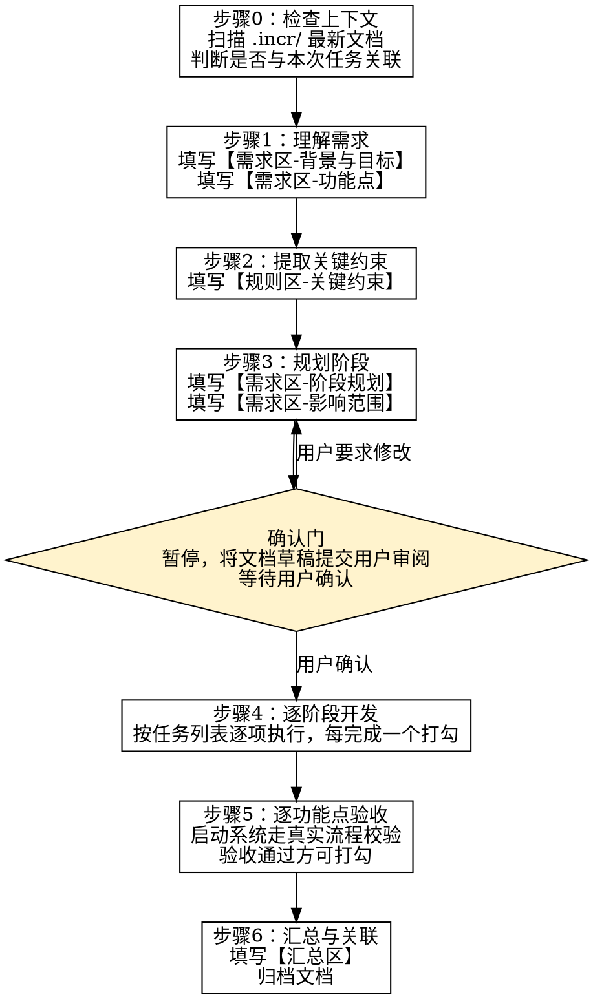

# 增量交付 v2（中文存档，不生效）


# 增量交付

为已有系统的小规模功能开发提供结构化交付流程。生成一份机器可执行、人类可阅读的开发文档，按阶段逐步推进。

## When to Use

- 在已有系统中通过 vibe coding 做增量开发
- 用户手动调用 `/incremental-delivery` 或通过 Skill tool invoke

## 固定规则

**R1. MVP 先行** — 每次达成最小可验收标准。不实现用户未明确提出的功能，不引入当前任务不需要的抽象、配置项、设计模式。

**R2. 先读后写** — 动手写代码前，先读懂同类型已有代码的风格和写法。CLAUDE.md 和 README 必读。

**R3. 阶段渐进** — 按阶段规划的任务列表逐步推进，每完成一个任务立即打勾，不跳步、不并行多个阶段。

**R4. 范围收敛** — 只验证本次新增内容，不做全系统回归。影响范围在需求区声明，不以兜底测试覆盖。

**R5. 验收即执行** — 验收点必须在真实系统运行中校验（API 调用、前端操作、日志输出），**禁止**仅凭代码审查或语法检查标记通过。验收不通过则标记失败并创建后续修复任务。

## 流程



## 步骤详解

### 步骤 0：检查上下文

1. 扫描 `.incr/` 中最新的文档（按 `YYYY-MM-NNN` 排序，取 NNN 最大者）
2. 判断本次任务是否与最新文档的功能域相关（同一模块、延续性需求）
3. 若相关 → 在最新文档中追加功能点，而非创建新文档
4. 若不相关或无法判断 → 创建新文档

### 步骤 1：理解需求

1. 阅读用户需求，提取功能点，编号 F1、F2、...
2. 撰写背景与目标（≤5 句）
3. 功能点以 `[ ] F1: ...` 格式填入文档

### 步骤 2：提取关键约束

三层递进，逐步缩小不确定性。

**第 1 层：偏差检测**

将代码中观察到的模式与 LLM 内化的标准规范对比。差值即潜在的隐性约束：

> 标准规范是什么？代码实际做了什么？两者之间的差距是否构成一条必须遵守的规则？

示例：代码中有 10 处 HTTP 调用，只有 2 处设了 timeout。标准规范是所有 HTTP 调用都应有 timeout → 偏差构成约束。

**第 2 层：暴露不确定性**

为每个功能点编写极简用户故事（谁 / 做什么 / 为什么，≤3 句）。然后回答：

> 关于这个用户故事的实现，有哪些是我不确定的？其中哪些不确定一旦猜错，会导致看似正确的代码产生错误结果？

不确定 + 猜错有后果 → 列为待确认项。答案最终从开发者或代码中获得确认后补入规则。

**第 3 层：交叉对照**

将第 1 层得到的直接规则与第 2 层的用户故事反推结果对照：

| 对照结果 | 处理 |
|----------|------|
| 验收点 √ 规则覆盖 | 保留 |
| 验收点 × 无规则覆盖 | 反推发现了遗漏 → 补入规则 |
| 规则 × 无验收点触达 | 标记待审（可能多余） |
| 验收点 ⇄ 规则冲突 | 验收点来自用户意图 → 规则过时，更新规则 |
| 两者分别合理但互斥 | 用户指令可能不一致 → 暂停，向用户澄清 |

规则服务于目标。当规则与锚（用户故事和验收点）冲突时，改规则；当锚本身可能有问题时，问人。

用户故事和反推结果留在文档中，使审查者能够验证推理链。如果无关键约束，此区留空或写"无"。

### 步骤 3：规划阶段

1. 按功能点拆分阶段，每个功能点 1～3 个阶段
2. 每阶段列出具体任务列表（读→写），不含验证
3. 标注阶段间依赖
4. 填写影响范围：直接改动、间接受影响、公共模块

**任务粒度**：一个任务 = 一个可独立描述、有明确意图的动作。同语义多文件改动合并为一个任务。

**阶段规模**：用任务数 + 文件数衡量，不用时间估算。

### 确认门

步骤 3 完成后 **暂停执行**，将文档草稿提交用户审阅。用户确认后方可进入步骤 4。

### 步骤 4：逐阶段开发

1. 按任务列表顺序逐项执行
2. 每完成一个任务，将 `[ ]` 标记为 `[x]`
3. 遵循固定规则和关键约束

### 步骤 5：逐功能点验收

一个功能点下的所有阶段完成后，对该功能点的验收条件逐项验证。

**验证方式（禁止仅靠代码审查）：**
- 启动系统，走真实流程（API 调用、前端点击、日志输出）
- Happy Path：正常流程，确认端到端行为符合预期
- 边界情况：任务数≤5 的小功能点只写 1～2 个关键边界

**验收结果处理：**
- 通过 → 标记 `[x]`
- 不通过 → 标记 `[!]` 并描述失败现象，在文档中创建后续修复任务
- 无法本地验证（如依赖外部服务）→ 标记 `[~]` 并注明原因

### 步骤 6：汇总与关联

填写：
- **改动概述**：一句话说明做了什么
- **关键文件表**：文件、改动类型、说明
- **关键决策**：复用了什么、为什么不引入新方案
- **遗留事项**：标注 `[FX]` 所属功能点，无则写"无"
- **关联引用**：`[[文档名]]` 格式，分前置依赖 / 后续影响

## 文档模板

```markdown
# {功能名称}

> 状态：起草中 / 待确认 / 进行中 / 已归档
> 日期：YYYY-MM-DD
> 关联：[[其他文档名]]

---

## 需求

### 背景与目标
<!-- ≤5 句，说明为什么做、做完能获得什么 -->

### 功能点
- [ ] F1：...
- [ ] F2：...

### 阶段规划

#### 阶段 1：XX（F1） — N 个任务 / M 个文件
本阶段达成：一句话描述

- [ ] 任务 1
- [ ] 任务 2

#### 阶段 2：YY（F2） — N 个任务 / M 个文件
依赖：阶段 1 完成

- [ ] 任务 1

### 影响范围

**直接改动：**
- `path/to/file` — 说明

**间接受影响：**
- 无 / 说明

**涉及的公共模块：**
- `path/to/module` — 复用/修改，说明

---

## 验收

<!-- 
  复选框标记说明：
  - [ ] 未验证
  - [x] 已通过真实系统校验
  - [!] 校验失败，需修复（附失败描述）
  - [~] 无法本地验证（附原因）
-->

### F1：功能点描述

**Happy Path：**
- [ ] 验收条件 1
- [ ] 验收条件 2

**边界情况：**
- [ ] 边界条件 1

---

## 规则

### 固定规则
（引用框架内置规则 R1-R4，不重复列出）

### 关键约束

<!-- 无则留空或写"无"。

##### 第 1 层：偏差检测
- 代码模式 vs 标准规范 → 偏差 → 约束

##### 第 2 层：用户故事 & 不确定性
- F1 故事：谁 / 做什么 / 为什么
- F1 不确定：[具体不确定项] — 猜错的后果：[具体后果] — 状态：待确认 / 已确认

##### 第 3 层：对照
- F1 的风险 → 由 [规则X] 覆盖 / 未覆盖（→补入）/ 冲突（→更新/澄清）

##### 规则
- [规则] — [违反后果]

--> ---

## 汇总

### 开发日志

**改动概述：**
一句话

**关键文件：**
| 文件 | 改动类型 | 说明 |
|------|----------|------|
| ... | ... | ... |

**关键决策：**
- ...

**遗留事项：**
- [FX] ... / 无

### 关联

**前置依赖：**
- [[文档名]] — 说明

**后续影响：**
- [[文档名]] — 说明
```

## 文档管理

- **存储位置**：当前项目根目录的 `.incr/` 隐藏文件夹，扁平存储
- **文件命名**：`YYYY-MM-NNN-name.md`
  - `YYYY-MM`：年月（如 `2026-07`）
  - `NNN`：当月序号，从 `001` 递增，每增加一个文档 +1
  - `name`：英文 kebab-case 功能简称
  - 示例：`2026-07-001-procurement-agent.md`、`2026-07-002-websearch-title.md`
- **关联格式**：`[[文档名]]`（不含 `.md` 后缀），跨文档引用仅使用文件名去除序号后的部分
- **状态流转**：起草中 → 待确认 → 进行中 → 已归档（验收通过即归档，不可变）
- **规则冲突优先级**：开发者要求 > 固定规则 > 关键约束
