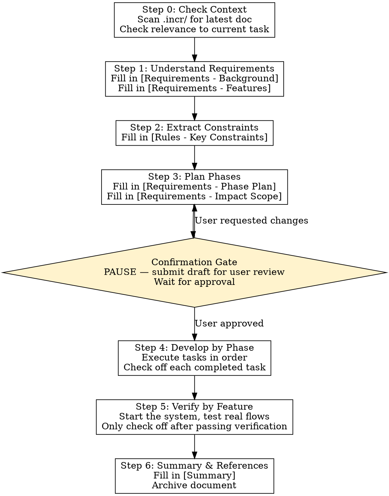

# Incremental Delivery

A structured delivery process for small-scale feature development on existing systems. Produces a machine-executable, human-readable development document, progressing phase by phase.

## When to Use

- Incremental development via vibe coding on existing systems
- User manually invokes `/incremental-delivery` or through Skill tool

## Fixed Rules

**R1. MVP First** — Reach the minimum acceptable standard each time. Don't implement features the user didn't explicitly request. Don't introduce abstractions, configuration options, or design patterns not required by the current task.

**R2. Read Before Write** — Before writing code, understand the style and patterns of existing similar code. CLAUDE.md and README are required reading.

**R3. Phased Progression** — Follow the planned task list phase by phase. Mark each task complete immediately — don't skip steps or run multiple phases in parallel.

**R4. Scope Discipline** — Only verify what was added in this increment. No full-system regression testing. Declare impact scope in the requirements section; don't rely on blanket test coverage.

**R5. Verify by Execution** — Acceptance criteria MUST be validated in a real running system (API calls, frontend interactions, log output). **Forbidden** to mark items complete based solely on code review or syntax checks. If verification fails, mark as failed and create a follow-up fix task.

## Process



## Step Details

### Step 0: Check Context

1. Scan `.incr/` for the latest document (sorted by `YYYY-MM-NNN`, take the highest NNN)
2. Determine if the current task relates to the same feature domain as the latest doc (same module, continuation)
3. If related → append features to the latest document rather than creating a new one
4. If unrelated or uncertain → create a new document

### Step 1: Understand Requirements

1. Read user requirements, extract feature points, number them F1, F2, ...
2. Write background and goals (max 5 sentences)
3. Write features in `[ ] F1: ...` format in the document

### Step 2: Extract Key Constraints

Three layers, progressively narrowing uncertainty.

**Layer 1: Deviation Detection**

Compare patterns observed in code against the LLM's internalized standard practices. The gap is a potential implicit constraint:

> What is the standard practice? What does the code actually do? Does the gap constitute a rule that must be followed?

Example: 10 HTTP calls in the code, only 2 have timeouts set. Standard practice is all HTTP calls should have timeouts → the deviation forms a constraint.

**Layer 2: Surface Uncertainty**

Write a minimal user story for each feature (who / what / why, max 3 sentences). Then answer:

> What am I uncertain about regarding this user story's implementation? Which uncertainties, if guessed wrong, would cause seemingly correct code to produce wrong results?

Uncertainty + wrong guess has consequences → mark as pending confirmation. Answers are confirmed by the developer or codebase, then added as rules.

**Layer 3: Cross-Reference**

Cross-reference Layer 1 rules against Layer 2 user story derived results:

| Result | Action |
|--------|--------|
| Acceptance point ✓ covered by rule | Keep |
| Acceptance point × not covered | Gap discovered → add rule |
| Rule × no acceptance point | Mark for review (possibly redundant) |
| Acceptance point ⇄ conflicts with rule | Acceptance from user intent → rule is outdated, update it |
| Both reasonable but mutually exclusive | User instructions may be inconsistent → pause, ask user |

Rules serve goals. When rules conflict with anchors (user stories and acceptance points), change the rules. When the anchors themselves may be wrong, ask the person.

Keep user stories and derived results in the document so reviewers can verify the reasoning chain. If no key constraints, leave this section empty or write "None".

### Step 3: Plan Phases

1. Split into phases by feature point, 1-3 phases per feature
2. Each phase lists concrete tasks (read → write), excluding verification
3. Note inter-phase dependencies
4. Fill in impact scope: direct changes, indirect effects, shared modules

**Task granularity**: One task = one independently describable action with clear intent. Merge semantically identical changes across multiple files into one task.

**Phase sizing**: Measure by task count + file count, not time estimates.

### Confirmation Gate

After Step 3, **PAUSE execution**. Submit the document draft for user review. Do not proceed to Step 4 until the user confirms.

### Step 4: Develop by Phase

1. Execute tasks in listed order
2. Mark `[ ]` as `[x]` upon completing each task
3. Follow fixed rules and key constraints

### Step 5: Verify by Feature

After all phases for a feature point are complete, verify each acceptance criterion.

**Verification method (code review alone is FORBIDDEN):**
- Start the system and walk through real flows (API calls, frontend clicks, log output)
- Happy Path: normal flow, confirm end-to-end behavior matches expectations
- Edge Cases: for features with ≤5 tasks, write only 1-2 key edge cases

**Verification outcome:**
- Pass → mark `[x]`
- Fail → mark `[!]` with failure description, create a follow-up fix task in the document
- Cannot verify locally (e.g., depends on external service) → mark `[~]` with reason

### Step 6: Summary & References

Fill in:
- **Change Summary**: One sentence describing what was done
- **Key Files Table**: file, change type, description
- **Key Decisions**: what was reused, why a new approach wasn't introduced
- **Remaining Items**: tagged with `[FX]` feature point, or "None"
- **Cross-References**: `[[doc-name]]` format, split into prerequisites / downstream impacts

## Document Template

```markdown
# {Feature Name}

> Status: Drafting / Pending Review / In Progress / Archived
> Date: YYYY-MM-DD
> References: [[other-doc-name]]

---

## Requirements

### Background & Goals
<!-- Max 5 sentences: why this is needed, what we gain -->

### Feature Points
- [ ] F1: ...
- [ ] F2: ...

### Phase Plan

#### Phase 1: XX (F1) — N tasks / M files
Goal for this phase: one-sentence description

- [ ] Task 1
- [ ] Task 2

#### Phase 2: YY (F2) — N tasks / M files
Depends on: Phase 1 complete

- [ ] Task 1

### Impact Scope

**Direct Changes:**
- `path/to/file` — description

**Indirect Effects:**
- None / description

**Shared Modules Touched:**
- `path/to/module` — reused/modified, description

---

## Acceptance

<!--
  Checkbox markers:
  - [ ] Unverified
  - [x] Verified in real system
  - [!] Verification failed, needs fix (attach failure description)
  - [~] Cannot verify locally (attach reason)
-->

### F1: Feature description

**Happy Path:**
- [ ] Acceptance criterion 1
- [ ] Acceptance criterion 2

**Edge Cases:**
- [ ] Edge case 1

---

## Rules

### Fixed Rules
(Reference built-in rules R1-R4; do not repeat here)

### Key Constraints

<!-- Leave empty or write "None" if none.

##### Layer 1: Deviation Detection
- Code pattern vs. standard practice → deviation → constraint

##### Layer 2: User Stories & Uncertainty
- F1 story: who / what / why
- F1 uncertainty: [specific uncertainty] — consequence if wrong: [specific consequence] — status: pending / confirmed

##### Layer 3: Cross-Reference
- F1 risk → covered by [Rule X] / uncovered (→ add rule) / conflict (→ update/clarify)

##### Rules
- [Rule] — [violation consequence]

--> ---

## Summary

### Development Log

**Change Summary:**
One sentence

**Key Files:**
| File | Change Type | Description |
|------|-------------|-------------|
| ... | ... | ... |

**Key Decisions:**
- ...

**Remaining Items:**
- [FX] ... / None

### References

**Prerequisites:**
- [[doc-name]] — description

**Downstream Impacts:**
- [[doc-name]] — description
```

## Document Management

- **Storage**: `.incr/` hidden directory at project root, flat storage
- **File Naming**: `YYYY-MM-NNN-name.md`
  - `YYYY-MM`: year-month (e.g., `2026-07`)
  - `NNN`: month-sequential number, starting at `001`, incrementing by 1 per new document
  - `name`: English kebab-case feature abbreviation
  - Examples: `2026-07-001-procurement-agent.md`, `2026-07-002-websearch-title.md`
- **Cross-Reference Format**: `[[doc-name]]` (without `.md` extension)
- **Status Flow**: Drafting → Pending Review → In Progress → Archived (archived upon passing acceptance, immutable thereafter)
- **Rule Precedence**: Developer requirements > Fixed Rules > Key Constraints
